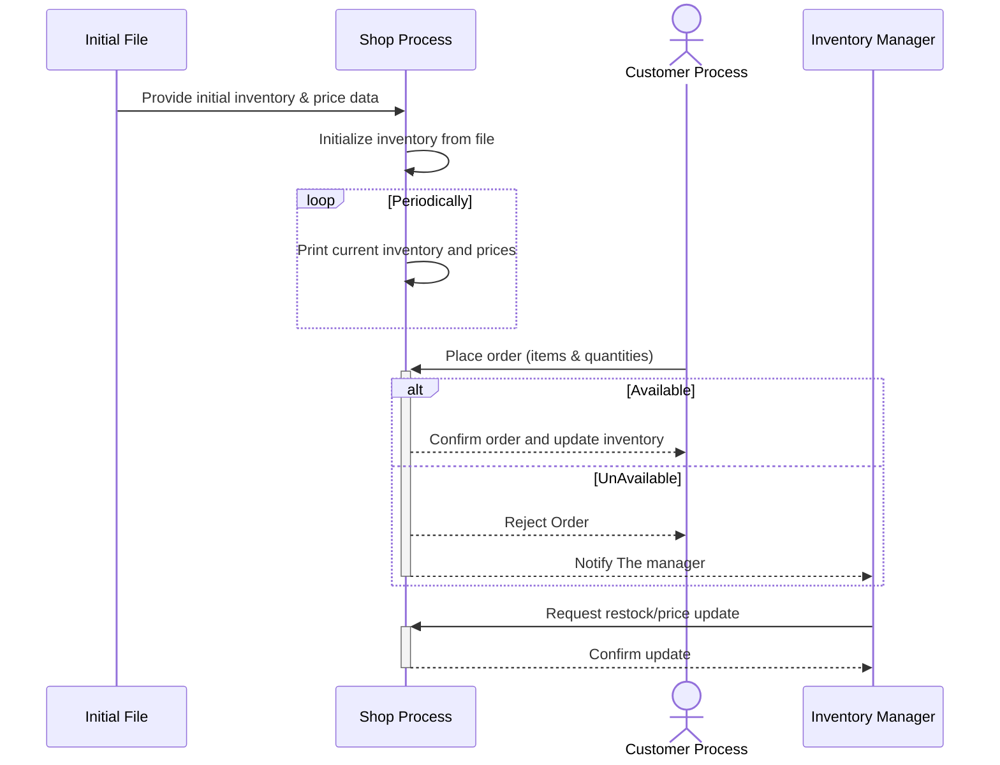

# IPC: Shop Simulation

A multi-process shop Simulation implemented in C, demonstrating efficient use of Linux IPC mechanisms.

## System Architecture

The system consists of three main processes:
1. **Shop Process**: Manages inventory and processes orders
2. **Customer Process**: Handles customer interactions and shopping cart
3. **Inventory Manager**: Monitors stock levels and handles restocking

### Sequence Diagram


### Key Features

- Real-time inventory management
- Shopping cart functionality
- Stock level notifications
- Price updates
- Concurrent order processing
- Thread-safe operations

## IPC Mechanisms Analysis

### Current Implementation

1. **Shared Memory (`struct shared_inventory`)**
   - Used for: Inventory data storage
   - Benefits:
     - Direct memory access (O(1) operations)
     - No data copying overhead
     - Multiple reader support
     - Real-time updates

2. **Semaphores**
   - Used for: Synchronization
   - Benefits:
     - Atomic operations
     - Built-in process queuing
     - Automatic cleanup (SEM_UNDO)
     - Kernel-level synchronization

3. **Message Queues**
   - Used for: Orders and notifications
   - Benefits:
     - Priority-based messaging
     - Built-in message types
     - Persistent queue
     - Asynchronous communication

### Alternative Analysis

1. **Pipes vs. Current Shared Memory**
   ```c
   // Pipe-based approach (rejected)
   int pipe_fd[2];
   pipe(pipe_fd);
   write(pipe_fd[1], &inventory, sizeof(struct inventory));
   read(pipe_fd[0], &inventory, sizeof(struct inventory));
   ```
   - Drawbacks:
     - Unidirectional communication
     - Data copying overhead
     - No random access
     - Multiple pipes needed

2. **File Locks vs. Current Semaphores**
   ```c
   // File lock approach (rejected)
   struct flock fl = {
       .l_type = F_WRLCK,
       .l_whence = SEEK_SET
   };
   fcntl(fd, F_SETLKW, &fl);
   ```
   - Drawbacks:
     - File system overhead
     - No counting mechanism
     - Slower operations
     - Manual cleanup required

3. **Unix Domain Sockets vs. Current Message Queues**
   ```c
   // Socket-based approach (rejected)
   struct sockaddr_un addr;
   int sock_fd = socket(AF_UNIX, SOCK_STREAM, 0);
   send(sock_fd, &order, sizeof(struct order), 0);
   ```
   - Drawbacks:
     - Connection overhead
     - Complex connection management
     - No built-in message types


## Building and Running

1. Compile the system:
   ```bash
   make clean && make
   ```

2. Start the processes in separate terminals:
   ```bash
   # Terminal 1
   ./shop_process

   # Terminal 2
   ./inventory_manager

   # Terminal 3
   ./customer_process
   ```

## Usage

### Customer Process
- View available items
- Add items to cart
- View cart contents
- Clear cart
- Checkout

### Inventory Manager
- View current inventory
- Restock items
- Update prices
- Monitor stock alerts

## Technical Details

### Data Structures
- Maximum items: 100
- Maximum item name length: 50 characters
- Shopping cart capacity: 10 items

### Files
- `shop_common.h`: Common definitions and structures
- `shop_process.c`: Main shop logic
- `customer_process.c`: Customer interface
- `inventory_manager.c`: Inventory management
- `inventory.txt`: Initial inventory data

## Conclusion

The current implementation using Shared Memory, Semaphores, and Message Queues provides the optimal balance of:
1. Performance (lowest latency and highest throughput)
2. Reliability (kernel-managed resources)
3. Functionality (built-in features like message types and synchronization)
4. Maintainability (clear separation of concerns)
5. Safety (proper synchronization and cleanup)

Alternative IPC mechanisms would introduce unnecessary complexity, higher latency, or reduced functionality, making them less suitable for this specific use case. 
